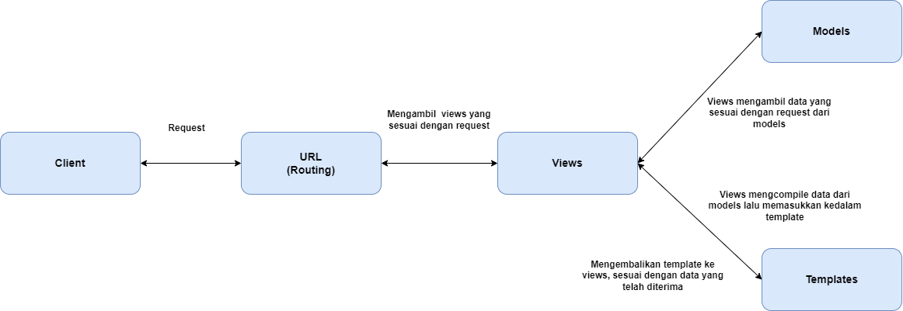

Nama           : Muhammad Yusuf Haikal

NPM            : 2206081490

Kelas          : PBP F

Link Adapable  :https://peternakan-gacor.adaptable.app/

# Tugas 2

## Jelaskan bagaimana cara kamu mengimplementasikan checklist di atas secara step-by-step (bukan hanya sekadar mengikuti tutorial).
Berikut adalah penjelasan cara implementasi  unuk masing - masing step pada checklist:

### Membuat sebuah proyek Django baru & membuat aplikasi dengan nama main pada proyek tersebut
- Untuk membuat sebuah proyek Django baru, buat sebuah direktori untuk proyek. Untuk tugas ini, direktori utama akan dinamakan ```peternakan_gacor```.
- Pada tugas ini, saya mengaktifkan virtual environment dengan cara pertama - tama buat virtual environment dengan menjalankan perintah ```python -m venv env``` lalu jalankan virtual environtment dengan menjalankan perintah ```env\Scripts\activate.bat```.
- Untuk proyek ini, buat file yang bernama ```requirements.txt``` yang berisikan dependencies yang akan diinstal dan kemudian digunakan pada proyek. Berikut isi dari file :
```
django
gunicorn
whitenoise
psycopg2-binary
requests
urllib3
```
- Install dependencies dengan menjalankan perintah ```pip install -r requirements.txt```

- Buat proyek Django dengan menjalankan command ```django-admin startproject peternakan_gacor```

- Sebelum membuat aplikasi ```main```, edit file ```settings.py``` dengan menambahkan ```ALLOWED_HOSTS = ["*"]``` untuk menambahkan akses untuk semua host, memudahkan proses deployment.

- Buat aplikasi main dengan menjalankan ```python manage.py startapp main``` lalu daftarkan aplikasi main kedalam file ```settings.py```.
```
    INSTALLED_APPS = [
    ...,
    'main',
    ...
]
```

### Melakukan routing pada proyek agar dapat menjalankan aplikasi main. 
- Routing pada proyek dilakukan dengan menambahkan rute URL kedalam file `urls.py` yang terdapat dalam direktori ** proyek ** yang kemudian dihubungkan ke tampilan main. Tambahkan pola url ke dalam `urlpatterns`.
```
from django.contrib import admin
from django.urls import path, include
from main.views import show_main

urlpatterns = [
    path('admin/', admin.site.urls),
    path('main/', include('main.urls')),
    path('', show_main, name='show_main')
]
```
- Pada kode diatas, saya menambahkan dua baris kode, yaitu `path('main/', include('main.urls'))` dan `path('', show_main, name='show_main')` yang bertujuan untuk menertapkan rute dasar untuk app `main`.

### Membuat model pada aplikasi main dengan nama Item
- Buat `models.py` yang memiliki atribut sesuai dengan kebutuhan aplikasi saya. Dalam kasus ini, terdapat 4 atribut yang saya masukkan, `name`, `amount`, dan `description`.
```
from django.db import models

class Items(models.Model):
    name = models.CharField(max_length=255)
    amount = models.IntegerField()
    description = models.TextField()
```
- Lakukan migrasi lalu aplikasikan ke basis data dengan menjalankan perintah 
```
python manage.py makemigrations
```
lalu 
```
python manage.py migrate
```

### Membuat sebuah fungsi pada views.py untuk dikembalikan ke dalam sebuah template HTML yang menampilkan nama aplikasi serta nama dan kelas.
-  Siapkan template HTML yang akan ditempilkan pada halaman aplikasi. Buat folder bernama `template` dalam direktori `main`, lalu buat file yang bernama `template.html`. Pada proyek ini, template yang akan saya gunakan seperti berikut:
```
<h1>Welcome to Peternakan Gacor!</h1>
<h4>Peternakan terbaik se-kukusan</h4>
<br>

    <div>
        <h5>Nama Barang:</h5>
        <p>{{ product.name }}</p>
        <h5>Deskripsi Barang:</h5>
        <p>{{ product.description }}</p>
        <h5>Jumlah Barang:</h5>
        <p>{{ product.amount }} buah</p>
    </div>
    <br>
    <br>


<h5>Muhammad Yusuf Haikal PBP F 22060801490</h5>
```

- Buat fungsi pada file `views.py` yang akan menyajikan data kedalam template. Pada file ini, terdapat data yang disimpan dalam list of dictionaries yang bernama `products_data`. Kemudian, fungsi `show_main` akan mengambil data pada list `products_data` yang kemudian akan di-* render * ke tampilan HTML.
```
from django.shortcuts import render

# Create your views here.
products_data = [
    {
        'name': 'Padi',
        'description': 'Tanaman padi (Oryza sativa L.) adalah tanaman penghasil beras yang merupakan sumber karbohidrat bagi sebagian penduduk dunia',
        'amount': 30,
    },
    {
        'name': 'Jagung',
        'description': 'Tanaman jagung (Zea mays) adalah salah satu tanaman serealia penting di dunia dan digunakan untuk berbagai keperluan.',
        'amount': 40,
    },
    {
        'name': 'Daging Wagyu',
        'description': 'Daging wagyu adalah daging sapi yang berasal dari Jepang. Daging ini memiliki tekstur yang lembut dan lemak yang melimpah.',
        'amount': 5,
    },
    {
        'name': 'Susu Kambing',
        'description': 'Susu kambing adalah susu yang dihasilkan oleh kambing. Susu kambing memiliki kandungan nutrisi yang lebih tinggi dibandingkan dengan susu sapi.',
        'amount' : 0,
    },
    {
        'name': 'Telur Ayam',
        'description': 'Telur ayam adalah telur yang dihasilkan oleh ayam. Telur ayam memiliki kandungan nutrisi yang tinggi dan dapat dikonsumsi dalam berbagai bentuk.',
        'amount' : 60
    }
]

def show_main(request):
    context = {
        'products' : products_data,
    }

    return render(request, "main.html", context)
```

### Membuat sebuah routing pada urls.py aplikasi main untuk memetakan fungsi yang telah dibuat pada views.py.
- Pada tahap ini, lakukan perubahan pada file `urls.py` pada direktori ** main **. Ini dilakukan untuk mengatur rute URL yang terkait dengan aplikasi main itu sendiri. 
```
from django.urls import path
from main.views import show_main

app_name = 'main'

urlpatterns = [
    path('', show_main, name='show_main'),
]
```

### Melakukan deployment ke Adaptable terhadap aplikasi yang sudah dibuat
- Untuk melakukan deployment, pertama lakukan push kedalam repository github yang kita gunakan untuk proyek ini. Lakukan `add`, `commit`, `push`.
- Selanjutnya, untuk tugas ini kita akan menggunakan platform Adaptable untuk melakukan deployment. Login menggunakan akun github yang terkait dengan repository yang telah dibuat. Ikuti instruksi yang disediakan pada website.

### Membuat sebuah README.md yang berisi tautan menuju aplikasi Adaptable yang sudah di-deploy
- Buat file README.md pada direktori proyek yang berisi tentang penjelasan masing - masing step, serta link menuju aplikasi. Terdapat sedikit kendala yaitu akun Adaptable seluruh mahasiswa UI telah didisable oleh pembuat website Adaptable, sehingga saya tidak dapt menyimpan tautan menuju aplikasi saya.


## Buatlah bagan yang berisi request client ke web aplikasi berbasis Django beserta responnya dan jelaskan pada bagan tersebut kaitan antara urls.py, views.py, models.py, dan berkas html


- Disini, terdapat 2 file `urls.py`, yang satu terdapat pada direktori app `main` yang menghubungkan rute setiap aplikasi dengan fungsi `views` yang sesuai, dan yang satu terdapat pada  direktori proyek yang berfungsi sebagai penghubung rute dasar dengan rute yang telah didefiniskan pada `urls.py` pada direktori `main`.
- `views.py` berisi fungsi yang mengatur tampilan data dari model yang kemudian dihubungkan dengan template.
- `models.py` berisi basis data dari aplikasi.
- Berkas html, dalam hal ini `template.html` menjadi penentu tampilan yang akan muncul pada aplikasi.

## Jelaskan mengapa kita menggunakan virtual environment? Apakah kita tetap dapat membuat aplikasi web berbasis Django tanpa menggunakan virtual environment?
Secara singkat, kita menggunakan virtual environment untuk mengisolasi linkgungan dari proyek yang kita buat, agar dependencies yang kita ingin gunakan tidak saling bertabrakan dengan dependencies yang sebelumnya mungkin sudah ada sebelumnya. Kita tetap bisa membuat aplikasi web tanpa menggunakan virtual environment, hanya saja kemungkinan terjadinya kendala besar karena masalah dependencies tadi.

## Jelaskan apakah itu MVC, MVT, MVVM dan perbedaan dari ketiganya.
- MVC atau Model-View-Controller merupakan pola desain pengembangan perangkat lunak yang menggunakan Model, View, dan Controller sebagai kerangka dasar pengembangan.
- MVT atau Model-View-Template merupakan pola desain pengembangan perangkat lunak yang menggunakan Model, View, dan Template sebagai kerangka dasar pengembangannya.
- MVVM atau Model-View-ViewModel merupakan pola desain pengembangan perangkat lunak.

Perbedaan dari ketiganya terdapat pada peran dan hubungan antara komponen tersebut,
MVC memiliki Controller yang mengatur logika aplikasi.
MVT menggantikan Controller dengan Template yang mengatur tampilan.
MVVM menggunakan ViewModel sebagai perantara antara Model dan View untuk mengisolasi logika tampilan.


# Tugas 3

## Apa perbedaan antara `POST` dan form `GET` dalam Django?

Secara umum, `POST` dan `GET` digunakan dengan tujuan yang berbeda ketika menggunakan forms di Django. Berikut adalah perbedaan dari keduanya dalam beberapa aspek:
1. Tujuan
- `GET` digunakan untuk me*request* data dari server, yang dimana *request* tersebut tidak mempengaruhi *state* dari sistem, dalam hal ini server.
- `POST` digunakan untuk *request* atau mengirim data ke server yang akan digunakan untuk mengubah *state* dari sistem, dalam hal ini yang dimaaksud adalah server.

2. Keamanan
- `GET` mengumpulkan data yang dikirimkan kedalam form menjadi suatu string, dan kemudian menggunakan string tersebut untuk menyusun suatu URL. URL tersebut akan memiliki alamat di mana data perlu dikirimkan. Karena data yang dimasukkan terdapat di dalam URL, `GET` tidak aman digunakan untuk form yang mengandung informasi sensitif seperi kata sandi.
- `POST` mengumpulkan lalu meng*encode* daat yang dimasukkan kedalam form, kemudian mengirimna ke server lalu menerima kembali respon dari server. Karena data yang disubmit tidak masuk kedalam URL, `POST` lebih aman ketika berurusan dengan data yang bersifat sensitif. 

## Apa perbedaan utama antara XML, JSON, dan HTML dalam konteks pengiriman data?
Berikut adalah perbandingan ketiganya dalam aspek tujuan, struktur, flesibilitas, dan contoh penggunaan:
1. XML (Extensible Markup Language):

- Tujuan: XML dirancang untuk mengatur dan mendeskripsikan data. Ini adalah bahasa markup generik yang digunakan untuk berbagai tugas terkait data, termasuk penyimpanan data, berkas konfigurasi, dan pertukaran data antara sistem.
- Struktur: XML menggunakan struktur berbentuk pohon dengan elemen-elemen yang dikelilingi oleh tag. Ini berfokus pada pengorganisasian dan representasi data secara hierarkis.
- fleksibilitas: XML sangat dapat disesuaikan, karena Anda dapat menentukan tag dan jenis data sendiri menggunakan DTD (Document Type Definition) atau XSD (XML Schema Definition).
- Contoh Penggunaan: XML umumnya digunakan dalam skenario seperti berkas konfigurasi, penyimpanan data, dan pertukaran data terstruktur antara sistem yang berbeda.

2. JSON (JavaScript Object Notation):

- Tujuan: JSON utamanya dirancang untuk pertukaran dan transmisi data. Ini adalah format ringan, mudah dibaca, dan mudah diproses untuk mengatur data, terutama untuk komunikasi antara server dan aplikasi web.
- Struktur: JSON menggunakan struktur pasangan kunci-nilai, menjadikannya format yang ringkas dan efisien untuk diproses oleh mesin. Ini adalah subset dari JavaScript dan sangat menyerupai objek JavaScript.
- Kesederhanaan: JSON memiliki sintaks yang lebih sederhana dibandingkan dengan XML, sehingga mudah digunakan dalam pengembangan web.
- Contoh Penggunaan: JSON umumnya digunakan dalam API web untuk mentransmisikan data antara server dan aplikasi klien. Ini juga digunakan dalam berkas konfigurasi dan pengaturan.

3. HTML (Hypertext Markup Language):

- Tujuan: HTML dirancang untuk membuat dokumen terstruktur untuk web. Ini berfokus pada menentukan struktur dan presentasi konten pada halaman web.
- Struktur: HTML menggunakan struktur berbentuk pohon untuk mendefinisikan elemen-elemen pada halaman web, seperti judul, paragraf, tautan, gambar, dan lainnya.
- Presentasi: HTML terutama berkaitan dengan cara konten disajikan dalam peramban web. Ini menggunakan tag dan atribut untuk memformat dan menggaya konten.
- Contoh Penggunaan: HTML eksklusif digunakan untuk membuat halaman web dan konten web. Ini diinterpretasikan oleh peramban web untuk menampilkan informasi kepada pengguna.
Secara ringkas, XML adalah bahasa struktur data generik dengan tingkat fleksibilitas tinggi, JSON adalah format pertukaran data ringan yang dirancang untuk kesederhanaan dan kemudahan dalam penguraian, dan HTML adalah bahasa markup untuk membuat dokumen terstruktur untuk web yang berfokus pada presentasi konten. Pilihan penggunaan tergantung pada kebutuhan khusus dari tugas atau aplikasi yang dihadapi, dengan XML dan JSON lebih berfokus pada data, sementara HTML berfokus pada presentasi konten web.

## Mengapa JSON sering digunakan dalam pertukaran data antara aplikasi web modern?
JSON sering digunakan dalam pembuatan aplikasi web modern karena beberapa alasan. Secara keseluruhan, JSON sering digunakan karena *syntax*nya yang mudah dibaca dan dipahami oleh manusia. Selain itu, JSON juga ringan, memerlukan lebih sedikit *coding* dan memproses data lebih cepat.

## Jelaskan bagaimana cara kamu mengimplementasikan checklist di atas secara step-by-step (bukan hanya sekadar mengikuti tutorial).
Berikut adalah penjelasan masing - masing langkah checklist diatas:

### Membuat input form untuk menambahkan objek model pada app sebelumnya.
- Pertama, kita akan melakukan implementasi *skeleton* sebagai kerangka dari views proyek kita. Buat folder `templates` pada folder utama, lalu buat file `base.html` yang berisi:
```

<!DOCTYPE html>
<html lang="en">
    <head>
        <meta charset="UTF-8" />
        <meta
            name="viewport"
            content="width=device-width, initial-scale=1.0"
        />
        
        
    </head>

    <body>
        
        
    </body>
</html>
```
- Buka `settings.py` dalam folder proyek `peternakan_gacor`, lalu tambahkan line `'DIRS': [BASE_DIR / 'templates']` kedalam bagian kode yang memiliki `TEMPLATES`, sehingga kode menjadi seperti berikut:
```
TEMPLATES = [
    {
        'BACKEND': 'django.template.backends.django.DjangoTemplates',
        'DIRS': [BASE_DIR / 'templates'],
        'APP_DIRS': True,
        'OPTIONS': {
            'context_processors': [
                'django.template.context_processors.debug',
                'django.template.context_processors.request',
                'django.contrib.auth.context_processors.auth',
                'django.contrib.messages.context_processors.messages',
            ],
        },
    },
]
```
tujuan penambahan baris kode tersebut adalah agar file `base.html` terdeteksi sebagai berkas template.

- Ubah file `main.htnl` dalam subdirekotri `templates` yang ada di dalam main agar meneyerupai `base.html` yang merupakan template utama.
```



<h1>Welcome to Peternakan Gacor!</h1>
<h4>Peternakan terbaik se-kukusan</h4>
<br>

    <div>
        <h5>Nama Barang:</h5>
        <p>{{ product.name }}</p>
        <h5>Deskripsi Barang:</h5>
        <p>{{ product.description }}</p>
        <h5>Jumlah Barang:</h5>
        <p>{{ product.amount }} buah</p>
    </div>
    <br>
    <br>

    <table>
        <tr>
            <th>Name</th>
            <th>Description</th>
            <th>Amount</th>
        </tr>
    
         Berikut cara memperlihatkan data produk di bawah baris ini 
    
        
            <tr>
                <td>{{product.name}}</td>
                <td>{{product.description}}</td>
                <td>{{product.amount}}</td>
            </tr>
        
    </table>
    
    <br />
    
    <a href="">
        <button>
            Add New Items
        </button>
    </a>
<h5>Muhammad Yusuf Haikal PBP F 22060801490</h5>

```
- Setelah kerangka jadi, sekarang lanjut ke menambahkan input form. Buat file baru didalam direktori `main` dengan nama `forms.py`. File ini akan membentuk struktur form yang ingin kita gunakan untuk menambah objek baru kedalam aplikasi kita. Isi folder `forms.py` akan berbentuk seperti berikut: 
```
from django.forms import ModelForm
from main.models import Items

class ItemsForm(ModelForm):
    class Meta:
        model = Items
        fields = ['name', 'amount', 'description']
```
Model yang digunakan sesuai dengan model yang telah kita buat pada tugas sebelumnya, yaitu `Items`. Kita mengimport model tersebut dengan `from main.models import Items`.  
`fields = ['name', 'amount', 'description']` menunjukkan data yang akan diisi ketika ingin mengirim form. Field nya sesuai dengan model `Items` dengan tiga atribut yaitu `name`, `amount`, dan `description`.

- Buka file `views.py` lalu import forms yang telah dibuat. Tambahkan juga beberapa package lain untuk keperluan forms.
```
from main.forms import ItemsForm
from django.urls import reverse
from django.http import HttpResponseRedirect
```

- Buat function baru di dalam `views.py` yang bertujuan untuk membuat formulir yang secara otomatis akan menambahkan Items baru yang disubmit dari formulir tersebut.
```
def create_items(request):
    form = ItemsForm(request.POST or None)

    if form.is_valid() and request.method == "POST":
        form.save()
        return HttpResponseRedirect(reverse('main:show_main'))
    
    context = {'form' : form}
    return render(request, "create_product.html", context)
```

Function tersebut akan membuat object `ItemsFrom` baru setiap dipanggil, kemudian memasukkan *QueryDict* sesuai dengan input yang diterima pada `requst.POST`. Function kemudian mengecek apakah isi dari form valid dengan `form.is_valid()` . Kemudian, form disave dengan `form.save()`, dan terakhir function akan meredirect setelah data disimpan dengan `return HttpResponseRedirect(reverse('main:show_main'))`.

- Ubah fungsi `show_main()` agar dapat mengambil semua object `Items` yang ada di database
```
def show_main(request):
    items = Items.objects.all()
    context = {
        'products' : items
    }

    return render(request, "main.html", context)
```

- Tambahkan path url agar fungsi dapat diakses didalam file `urls.py` yang terdapat dalam folder `main`.
```
from django.urls import path
from main.views import show_main, create_items, show_xml, show_json, show_xml_by_id, show_json_by_id

app_name = 'main'

urlpatterns = [
    path('', show_main, name='show_main'),
    path('create-items', create_items, name='create_items')
    }
```

- Buat file `create_product.html` dalam file `main/templates`. File ini akan menjadi template untuk form yang kita buat.
```
 


<h1>Add New Product</h1>

<form method="POST">
    
    <table>
        {{ form.as_table }}
        <tr>
            <td></td>
            <td>
                <input type="submit" value="Add Product"/>
            </td>
        </tr>
    </table>
</form>


```
- `<form method="POST">` menandakan bahwa blok merupakan form dengan metode POST
- `{{ % form.as_table }}` digunakan untuk menampilkan forms yang telah disubmit dalam bentuk tabel.
- `<input type="submit" value="Add Product"/>` digunakan untuk membuat tombol submit yang akan digunakan untuk mengirim request ke view `create_product(request)`.

- Ubah file `main.html` sehingga menjadi:
```



<h1>Welcome to Peternakan Gacor!</h1>
<h4>Peternakan terbaik se-kukusan</h4>
<br>

    <div>
        <h5>Nama Barang:</h5>
        <p>{{ product.name }}</p>
        <h5>Deskripsi Barang:</h5>
        <p>{{ product.description }}</p>
        <h5>Jumlah Barang:</h5>
        <p>{{ product.amount }} buah</p>
    </div>
    <br>
    <br>

    <table>
        <tr>
            <th>Name</th>
            <th>Description</th>
            <th>Amount</th>
        </tr>
    
         Berikut cara memperlihatkan data produk di bawah baris ini 
    
        
            <tr>
                <td>{{product.name}}</td>
                <td>{{product.description}}</td>
                <td>{{product.amount}}</td>
            </tr>
        
    </table>
    
    <br />
    
    <a href="">
        <button>
            Add New Items
        </button>
    </a>
<h5>Muhammad Yusuf Haikal PBP F 22060801490</h5>

```

### Tambahkan 5 fungsi `views` untuk melihat objek yang sudah ditambahkan dalam format HTML, XML, JSON, XML by ID, JSON by ID & Membuat routing URL untuk masing-masing `views` yang telah ditambahkan pada poin 2.
Pertama - tama, import `HttpResponse` dan `Serializer` ke bagian paling atas file `views.py`
```
from django.http import HttpResponse
from django.core import serializers
```
 
- HTML
untuk HTML, fungsi `views` sudah ada di dalam fungsi `show_main()` sehingga kita tidak perlu membuat fungsi baru.

- XML
Buat fungsi `show_xml()` dengan isi:
```
def show_xml(request):
    data = Items.objects.all()
    return HttpResponse(serializers.serialize("xml", data), content_type="application/xml")
```

- JSON
Buat fungsi `show_json()` dengan isi:
```
def show_json(request):
    data = Items.objects.all()
    return HttpResponse(serializers.serialize("json", data), content_type="application/json")
```

- XML by ID
Buat fungsi `show_xml_by_id()` dengan isi:
```
def show_xml_by_id(request, id):
    data = Items.objects.filter(pk=id)
    return HttpResponse(serializers.serialize("xml", data), content_type="application/xml")
```

- JSON by ID
Buat fungsi `show_json_by_id()` dengan isi:
```
def show_json_by_id(request, id):
    data = Items.objects.filter(pk=id)
    return HttpResponse(serializers.serialize("json", data), content_type="application/json")
```

- Buka file `urls.py` lalu edit untuk mengimpor masing - masing fungsi
`from main.views import show_main, create_items, show_xml, show_json, show_xml_by_id, show_json_by_id`

- Tambahkan *path url* ke dalam `urlpatterns` untuk mengakses fungsi yang telah dibuat.
```
...
urlpatterns = [
    path('', show_main, name='show_main'),
    path('create-items', create_items, name='create_items'),
    path('xml/', show_xml, name='show_xml'),
    path('json/', show_json, name='show_json'),
    path('xml/<int:id>', show_xml_by_id, name='show_xml_by_id'),
    path('json/<int:id>', show_json_by_id, name='show_json_by_id')
]
```

### Mengakses kelima URL di poin 2 menggunakan Postman, membuat screenshot dari hasil akses URL pada Postman


# Tugas 3

## Apa itu Django  `UserCreationForm` dan jelaskan apa kelebihan dan kekurangannya
`UserCreationForm` merupakan impor formulir bawaan yang memudahkan pembuatan formulir pendaftaran pengguna dalam aplikasi web yang dikembangkan dengan Django. 

Kelebihan yang paling utama dari `UserCreationForm` adalah kemudahan dalam pembuaan formulir pendaftaran. Selain itu, `UserCreationForm` sudah terintegrasi dengan model pengguna Django, sehingga mempermudah penyimpanan data yang dimasukkan kedalam form pendaftaran menuju database. Kekurangan dari `UserCreationForm` terdapat pada keterbatasan ** customization ** yang dapat dilakukan, hanya mencakup isian data standar seperti nama pengguna, kata sandi, dst. Jika ingin melakukan kustomisasi, prosesnya lumayan rumit. 

## Apa perbedaan antara autentikasi dan otorisasi dalam konteks Django, dan mengapa keduanya penting?

Autentikasi merupakan proses memverifikasi identitas pengguna. Ini membuktikan bahwa pengguna yang mengakses aplikasi adalah orang yang mereka klaim, sementara otorisasi merupakan proses menentukan hak akses pengguna setelah mereka terautentikasi. Ini berkaitan dengan mengontrol apa yang dapat dilihat, dibaca, ditulis, atau diubah oleh pengguna yang telah terotentikasi. Keduanya merupakan konsep yang penting untuk menjaga kemanan aplikasi yang kita buat, siapa yang dapat mengakses dan siapa yang mengakses perlu kita ketahui agar menghindari penggunaan akses yang tidak diinginkan terjadi.

## Apa itu cookies dalam konteks aplikasi web, dan bagaimana Django menggunakan cookies untuk mengelola data sesi pengguna?
Karena dalam pengembangan aplikasi web yang menggunnakan HTTP bersifat stateless, dimana setiap aktivitas (request/response) bersifat independen, tidak tersimpan pada aktivitas terdahulu, ini mengharuskan komputer klien yang menjalankan browser untuk membuat koneksi TCP ke server setiap kali melakukan request. Cookies adalah data kecil yang disimpan di sisi klien (biasanya dalam browser web) oleh server aplikasi web. Cookies digunakan untuk menyimpan informasi yang berkaitan dengan sesi atau interaksi pengguna dengan aplikasi web. Mereka berguna untuk mengenali pengguna ketika mereka kembali ke situs web, menyimpan preferensi atau informasi login, dan menyediakan pengalaman yang lebih personal.Django, seperti banyak kerangka kerja web lainnya, menggunakan cookies untuk mengelola data sesi pengguna. Data sesi pengguna adalah informasi yang berhubungan dengan sesi pengguna saat dia sedang berinteraksi dengan aplikasi web.

## Apakah penggunaan cookies aman secara default dalam pengembangan web, atau apakah ada risiko potensial yang harus diwaspadai?
Penggunaan cookies dalam pengembangan web adalah alat yang umum digunakan dan aman secara default jika diimplementasikan dengan benar. Namun, tetap terdapat bebara resiko keamanan seperti *session hijacking* di mana seorang penyerang mencuri cookie sesi pengguna untuk mengakses akun pengguna tanpa izin.

## Jelaskan bagaimana cara kamu mengimplementasikan checklist di atas secara step-by-step

### Mengimplementasikan fungsi registrasi, login, dan logout untuk memungkinkan pengguna untuk mengakses aplikasi sebelumnya dengan lancar.
- Pertama, untuk fungsi registrasi, lakukan perubahan dalam file `views.py` dalam folder `main` lalu buat fungsi dengan nama `register`. Lakukan impor terlebih dahulu:
```
from django.shortcuts import redirect
from django.contrib.auth.forms import UserCreationForm
from django.contrib import messages  
```

- Buat fungsi register yang menerima parameter request sebagai berikut: 
```
def register(request):
    form = UserCreationForm()

    if request.method == "POST":
        form = UserCreationForm(request.POST)
        if form.is_valid():
            form.save()
            messages.success(request, 'Your account has been successfully created!')
            return redirect('main:login')
    context = {'form':form}
    return render(request, 'register.html', context)
```
Fungsi ini akan membuat `UserCreationForm` baru dengan memasukkan QueryDictberdasarkan inpus user.

- Buat file HTML baru untuk halaman regisrasi dalam folder `main/template` yang bernama `register.html`. Isi folder adalah sebagai berikut:
```



    <title>Register</title>


  

<div class = "login">
    
    <h1>Register</h1>  

        <form method="POST" >  
              
            <table>  
                {{ form.as_table }}  
                <tr>  
                    <td></td>
                    <td><input type="submit" name="submit" value="Daftar"/></td>  
                </tr>  
            </table>  
        </form>

      
        <ul>   
              
                <li>{{ message }}</li>  
                  
        </ul>   
    

</div>  


```
Ini akan menjadi template ketika kita mengakses halaman register nanti.

- Lakukan routing pada `urls.py` folder main untuk menghubungkan fungsi yang telah dibuat. 
```
from main.views import register #sesuaikan dengan nama fungsi yang dibuat
```
lalu tambahkan ke path url dalam `urlpatterns`
```
path('register/', register, name='register')
```

- Untuk membuat fungsi login, tambahkan fungsi `login_user` kedalam `views.py`. Import `authenticate` dan `login` terlebih dahulu.
```
from django.contrib.auth import authenticate, login
```
- Buat fungsi `login_user` yang menerima request sebagai parameter.
```
def login_user(request):
    if request.method == 'POST':
        username = request.POST.get('username')
        password = request.POST.get('password')
        user = authenticate(request, username=username, password=password)
        if user is not None:
            login(request, user)
            return redirect('main:show_main')
        else:
            messages.info(request, 'Sorry, incorrect username or password. Please try again.')
    context = {}
    return render(request, 'login.html', context)
```
Fungsi ini akan menerima username dan password dari penggunaka kemudian melakukan autentikasi berdasarkan username dan password yang diterima.

- Buat template untuk halaman login dalam folder `main/templates` yang bernama `login.html`. Isinya seperti berikut:
```



    <title>Login</title>




<div class = "login">

    <h1>Login</h1>

    <form method="POST" action="">
        
        <table>
            <tr>
                <td>Username: </td>
                <td><input type="text" name="username" placeholder="Username" class="form-control"></td>
            </tr>
                    
            <tr>
                <td>Password: </td>
                <td><input type="password" name="password" placeholder="Password" class="form-control"></td>
            </tr>

            <tr>
                <td></td>
                <td><input class="btn login_btn" type="submit" value="Login"></td>
            </tr>
        </table>
    </form>

    
        <ul>
            
                <li>{{ message }}</li>
            
        </ul>
         
        
    Don't have an account yet? <a href="">Register Now</a>

</div>


```

- Lakukan routing fungsi pada file `urls.py` dalam `main`. impor fungsi yang telah dibuat tadi
```
from main.views import login_user
```
lalu tambahkan path url kedalam `urlpatterns`
```
path('logout/', logout_user, name='logout')
```

- Kita juga dapat membatasi agar halaman Main hanya dapat dilihat oleh user yang telah login. 

- Buka file `views.py`, lakukan import:
```
from django.contrib.auth.decorators import login_required
```
lalu diatas ` def show_main`, tambahkan 
`@login_required(login_url='/login')`

### Membuat dua akun pengguna dengan masing-masing tiga dummy data menggunakan model yang telah dibuat pada aplikasi sebelumnya untuk setiap akun di lokal & Menghubungkan model Item dengan User.

Untuk memisahkan data yang dimiliki masinng - masing akun, kita perlu menghubungkan model `Item` dengan `User`.
- Pertama, import User kedalam file `models.py`.
```
from django.contrib.auth.models import User
```
lalu, kedalam model yang saya gunakan, yaitu `Items`, tambahkan `user`.
```
class Items(models.Model):
    user = models.ForeignKey(User, on_delete=models.CASCADE)
    name = models.CharField(max_length=255)
    amount = models.IntegerField()
    description = models.TextField()
```

- Buka `views.py` dalam folder `main` lalu lakukan perubahan pada fungsi yang berfungsi untuk menambahkan items, yaitu `create_items`.
```
def create_items(request):
    form = ItemsForm(request.POST or None)

    if form.is_valid() and request.method == "POST":
        item = form.save(commit=False)
        item.user = request.user
        item.save()
        return HttpResponseRedirect(reverse('main:show_main'))
    
    context = {'form' : form}
    return render(request, "create_product.html", context)
```
Modifikasi ini dilakukan untuk menyimpan data user terlebih dahulu sebelum menyimpan form ke database, sehingga menandakan bahwa apa yang diisi dimiliki oleh user yang sedang login.

- Ubah `show_main` untuk hanya menunjukkan item dari user yang sedang login.
```
def show_main(request):
    items = Items.objects.filter(user=request.user)
    context = {
        'name' : request.user.username,
        ...
    }
```
Lakukan migrasi sebelum menjalankan program karena telah terjadi perubahan models.

- Untuk membuat akun dan dummy data, kita tinggal lakukan register kemudian mengisi form menambah barang.

### Menampilkan detail informasi pengguna yang sedang logged in seperti username dan menerapkan cookies seperti last login pada halaman utama aplikasi.

- Untuk menggunakan detail informasi pengguna yang sedang logged in, kita memerlukan cookies. 
- Modifikasi file `views.py` dalam folder `main` lalu lakukan beberapa import.
```
import datetime
from django.http import HttpResponseRedirect
from django.urls import reverse
```

- Tambahkan cookie pada fungsi `login_user` yang akan menyimmpan kapan terakhir user melakukan login.
```
def login_user(request):
    if request.method == "POST":
        username = request.POST.get('username')
        password = request.POST.get('password')

        user = authenticate (request, username=username, password=password)

        if user is not None:
            login(request, user)
            response = HttpResponseRedirect(reverse('main:show_main'))
            response.set_cookie('last_login', str(datetime.datetime.now()))
            return response
        else:
            messages.info(request, 'Sorry, incorrect username or password. Please try again.')
    context = {}
    return render(request, 'login.html', context)
```

- Lakukan perubahan pada fungsi `show_main` pada bagian `context` yang akan mengambil data dari cookie tadi.
```
def show_main(request):
    items = Items.objects.filter(user=request.user)
    context = {
        'name' : request.user.username,
        'products' : items,
        'last_login':request.COOKIES['last_login'],
    }
    return render(request, "main.html", context)
```

- Ubah folder `main.html` untuk menampilkan data dari cookie tadi. Kita akan menampilkan waktu terakhir user login:
```
...
<h5>Sesi terakhir login: {{ last_login }}</h5>
...
```
- Refresh halaman login.
